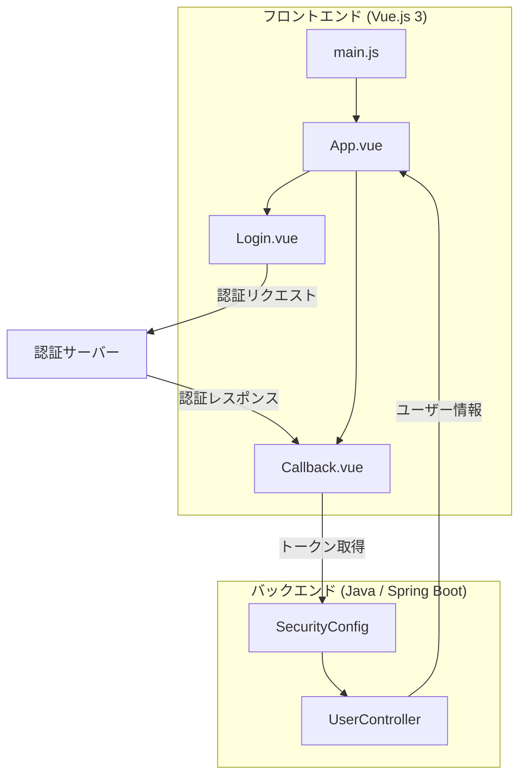

# OAuth 2.0 / OpenID Connect 実装の詳細設計書

## 1. システム概要

本システムは、Vue.js 3をフロントエンド、Java（Spring Boot）をバックエンドとして使用し、OAuth 2.0 / OpenID Connect認証を実装したWebアプリケーションです。

## 2. アーキテクチャ概要



## 3. フロントエンド詳細設計

### 3.1 main.js

機能：アプリケーションのエントリーポイント、OIDCの設定

```javascript
import { createApp } from 'vue'
import App from './App.vue'
import { UserManager } from 'oidc-client'

const oidcConfig = {
  authority: 'https://your-auth-server.com',
  client_id: 'your-client-id',
  redirect_uri: 'http://localhost:8080/callback',
  response_type: 'code',
  scope: 'openid profile email',
  automaticSilentRenew: true,
}

const userManager = new UserManager(oidcConfig)

const app = createApp(App)
app.provide('userManager', userManager)
app.mount('#app')
```

主な機能：
- OIDC設定の初期化
- UserManagerのインスタンス作成
- Vueアプリケーションの作成とマウント
- UserManagerの依存性注入

### 3.2 Login.vue

機能：ログインボタンの表示と認証フローの開始

```vue
<template>
  <button @click="login">Login</button>
</template>

<script>
import { inject } from 'vue'

export default {
  setup() {
    const userManager = inject('userManager')

    const login = async () => {
      try {
        await userManager.signinRedirect()
      } catch (error) {
        console.error('Login failed', error)
      }
    }

    return { login }
  }
}
</script>
```

主な機能：
- ログインボタンの表示
- UserManagerを使用した認証リダイレクトの実行

### 3.3 Callback.vue

機能：認証コールバックの処理

```vue
<template>
  <div>Processing login...</div>
</template>

<script>
import { inject, onMounted } from 'vue'
import { useRouter } from 'vue-router'

export default {
  setup() {
    const userManager = inject('userManager')
    const router = useRouter()

    onMounted(async () => {
      try {
        const user = await userManager.signinRedirectCallback()
        console.log('User', user)
        router.push('/')
      } catch (error) {
        console.error('Login callback failed', error)
      }
    })
  }
}
</script>
```

主な機能：
- 認証サーバーからのコールバック処理
- ユーザー情報の取得と処理
- 認証成功後のリダイレクト

## 4. バックエンド詳細設計

### 4.1 application.yml

機能：Spring Bootアプリケーションの設定

```yaml
spring:
  security:
    oauth2:
      client:
        registration:
          auth0:
            client-id: your-client-id
            client-secret: your-client-secret
            scope:
              - openid
              - profile
              - email
        provider:
          auth0:
            issuer-uri: https://your-auth-server.com/
```

主な設定：
- OAuth 2.0クライアントの登録情報
- 認証プロバイダーの設定

### 4.2 SecurityConfig.java

機能：Spring Securityの設定

```java
import org.springframework.context.annotation.Bean;
import org.springframework.security.config.annotation.web.builders.HttpSecurity;
import org.springframework.security.config.annotation.web.configuration.EnableWebSecurity;
import org.springframework.security.web.SecurityFilterChain;

@EnableWebSecurity
public class SecurityConfig {

    @Bean
    public SecurityFilterChain filterChain(HttpSecurity http) throws Exception {
        http
            .authorizeRequests()
                .antMatchers("/", "/login**", "/callback/", "/webjars/**", "/error**").permitAll()
                .anyRequest().authenticated()
            .and()
            .oauth2Login();
        return http.build();
    }
}
```

主な機能：
- セキュリティフィルターチェーンの設定
- 認証が必要なエンドポイントの指定
- OAuth 2.0ログインの設定

### 4.3 UserController.java

機能：認証されたユーザー情報の取得

```java
import org.springframework.security.core.annotation.AuthenticationPrincipal;
import org.springframework.security.oauth2.core.oidc.user.OidcUser;
import org.springframework.web.bind.annotation.GetMapping;
import org.springframework.web.bind.annotation.RestController;

@RestController
public class UserController {

    @GetMapping("/user")
    public OidcUser getUser(@AuthenticationPrincipal OidcUser oidcUser) {
        return oidcUser;
    }
}
```

主な機能：
- 認証されたユーザーの情報を返すエンドポイントの提供

## 5. 認証フロー

1. ユーザーがログインボタンをクリック（Login.vue）
2. フロントエンドが認証サーバーにリダイレクト（UserManager.signinRedirect()）
3. ユーザーが認証サーバーで認証を行う
4. 認証サーバーがアプリケーションのコールバックURLにリダイレクト
5. コールバックページ（Callback.vue）が認証結果を処理
6. バックエンド（SecurityConfig）がトークンを検証
7. 認証成功時、ユーザー情報が取得可能になる（UserController）

## 6. セキュリティ考慮事項

1. HTTPS通信の使用を徹底
2. クライアントシークレットの安全な管理（環境変数使用）
3. トークンの適切な有効期限設定
4. CSRFトークンの実装
5. 適切なスコープの使用

## 7. 拡張性と保守性

1. コンポーネント間の疎結合を維持
2. 環境変数を使用した設定の外部化
3. エラーハンドリングの一元化
4. ログ出力の適切な実装

## 8. テスト計画

1. ユニットテスト：各コンポーネントの個別テスト
2. 統合テスト：フロントエンドとバックエンドの連携テスト
3. E2Eテスト：実際の認証フローのテスト
4. セキュリティテスト：脆弱性スキャンとペネトレーションテスト

この詳細設計書に基づいて実装を進めることで、セキュアで保守性の高いOAuth 2.0 / OpenID Connect認証システムを構築できます。