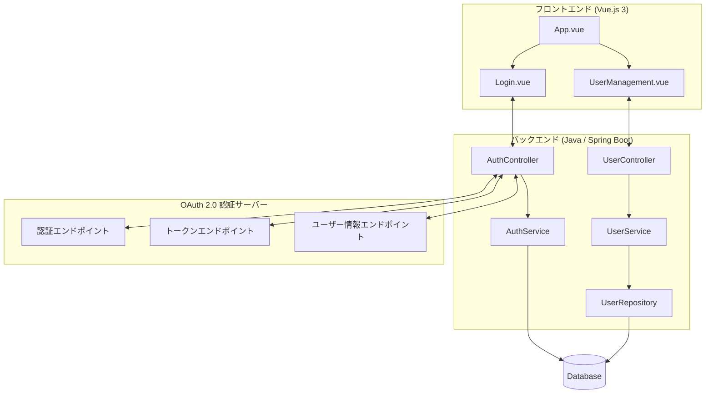
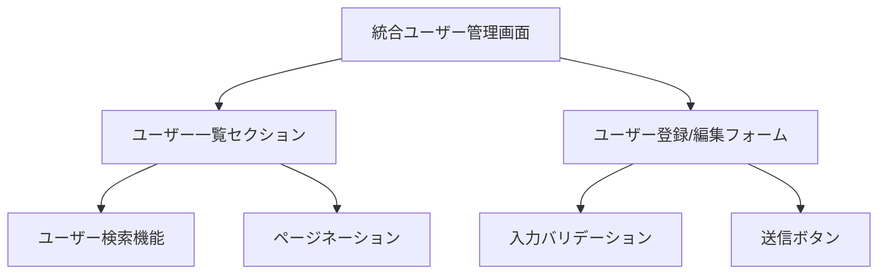
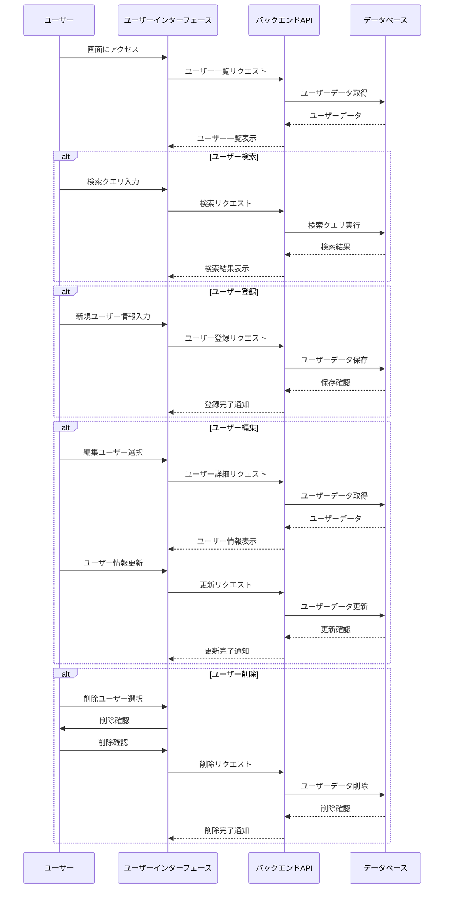

## 2. システム構成



### 説明

- **フロントエンド**:

  - `App.vue`: アプリケーションのメインコンポーネント
  - `UserManagement.vue`: ユーザー管理、登録、編集機能を統合したコンポーネント

- **バックエンド**:

  - `UserController`: API エンドポイントを提供し、フロントエンドからのリクエストを処理
  - `UserService`: ビジネスロジックを実装
  - `UserRepository`: データベースとのインタラクションを担当

- **データベース**: ユーザー情報を保存

この構成により、1 つの画面（UserManagement.vue）でユーザーの一覧表示、登録、編集、削除の全機能を提供します。

## 3. 画面構成



## 4. 処理フロー



## 1. フロントエンド実装 (Vue.js 3)

### UserManagement.vue

```vue
<template>
  <div class="user-management">
    <h1>ユーザー管理</h1>

    <!-- ユーザー一覧セクション -->
    <div class="user-list">
      <input v-model="searchQuery" placeholder="ユーザー検索..." />
      <table>
        <thead>
          <tr>
            <th>ID</th>
            <th>名前</th>
            <th>メールアドレス</th>
            <th>操作</th>
          </tr>
        </thead>
        <tbody>
          <tr v-for="user in filteredUsers" :key="user.id">
            <td>{{ user.id }}</td>
            <td>{{ user.name }}</td>
            <td>{{ user.email }}</td>
            <td>
              <button @click="editUser(user)">編集</button>
              <button @click="deleteUser(user.id)">削除</button>
            </td>
          </tr>
        </tbody>
      </table>
      <div class="pagination">
        <button @click="prevPage" :disabled="currentPage === 0">前へ</button>
        <span>ページ {{ currentPage + 1 }} / {{ totalPages }}</span>
        <button @click="nextPage" :disabled="currentPage === totalPages - 1">
          次へ
        </button>
      </div>
    </div>

    <!-- ユーザー登録/編集フォーム -->
    <div class="user-form">
      <h2>{{ isEditing ? "ユーザー編集" : "ユーザー登録" }}</h2>
      <form @submit.prevent="submitForm">
        <div>
          <label for="name">名前:</label>
          <input id="name" v-model="form.name" required />
        </div>
        <div>
          <label for="email">メールアドレス:</label>
          <input id="email" v-model="form.email" type="email" required />
        </div>
        <div v-if="!isEditing">
          <label for="password">パスワード:</label>
          <input
            id="password"
            v-model="form.password"
            type="password"
            required
          />
        </div>
        <button type="submit">{{ isEditing ? "更新" : "登録" }}</button>
        <button type="button" v-if="isEditing" @click="cancelEdit">
          キャンセル
        </button>
      </form>
    </div>
  </div>
</template>

<script>
import { ref, reactive, computed, onMounted } from "vue";
import axios from "axios";

export default {
  setup() {
    const users = ref([]);
    const searchQuery = ref("");
    const form = reactive({
      id: null,
      name: "",
      email: "",
      password: "",
    });
    const isEditing = ref(false);
    const currentPage = ref(0);
    const totalPages = ref(0);
    const pageSize = 10;

    const filteredUsers = computed(() => {
      return users.value.filter(
        (user) =>
          user.name.toLowerCase().includes(searchQuery.value.toLowerCase()) ||
          user.email.toLowerCase().includes(searchQuery.value.toLowerCase())
      );
    });

    const fetchUsers = async () => {
      try {
        const response = await axios.get(
          `/api/users?page=${currentPage.value}&size=${pageSize}&search=${searchQuery.value}`
        );
        users.value = response.data.content;
        totalPages.value = response.data.totalPages;
      } catch (error) {
        console.error("Failed to fetch users", error);
      }
    };

    const submitForm = async () => {
      try {
        if (isEditing.value) {
          await axios.put(`/api/users/${form.id}`, form);
        } else {
          await axios.post("/api/users", form);
        }
        await fetchUsers();
        resetForm();
      } catch (error) {
        console.error("Failed to submit form", error);
      }
    };

    const editUser = (user) => {
      Object.assign(form, user);
      isEditing.value = true;
    };

    const deleteUser = async (id) => {
      if (confirm("本当に削除しますか？")) {
        try {
          await axios.delete(`/api/users/${id}`);
          await fetchUsers();
        } catch (error) {
          console.error("Failed to delete user", error);
        }
      }
    };

    const cancelEdit = () => {
      resetForm();
    };

    const resetForm = () => {
      Object.assign(form, { id: null, name: "", email: "", password: "" });
      isEditing.value = false;
    };

    const prevPage = () => {
      if (currentPage.value > 0) {
        currentPage.value--;
        fetchUsers();
      }
    };

    const nextPage = () => {
      if (currentPage.value < totalPages.value - 1) {
        currentPage.value++;
        fetchUsers();
      }
    };

    onMounted(() => {
      fetchUsers();
    });

    return {
      users,
      searchQuery,
      filteredUsers,
      form,
      isEditing,
      currentPage,
      totalPages,
      submitForm,
      editUser,
      deleteUser,
      cancelEdit,
      prevPage,
      nextPage,
    };
  },
};
</script>

<style scoped>
.user-management {
  max-width: 800px;
  margin: 0 auto;
  padding: 20px;
}

.user-list {
  margin-bottom: 20px;
}

table {
  width: 100%;
  border-collapse: collapse;
}

th,
td {
  border: 1px solid #ddd;
  padding: 8px;
  text-align: left;
}

th {
  background-color: #f2f2f2;
}

.pagination {
  margin-top: 10px;
  text-align: center;
}

.user-form {
  background-color: #f9f9f9;
  padding: 20px;
  border-radius: 5px;
}

form div {
  margin-bottom: 10px;
}

label {
  display: block;
  margin-bottom: 5px;
}

input {
  width: 100%;
  padding: 5px;
  border: 1px solid #ddd;
  border-radius: 3px;
}

button {
  padding: 5px 10px;
  background-color: #4caf50;
  color: white;
  border: none;
  border-radius: 3px;
  cursor: pointer;
}

button:hover {
  background-color: #45a049;
}
</style>
```

## 2. バックエンド実装 (Java / Spring Boot)

### UserController.java

```java
package com.example.usermanagement.controller;

import com.example.usermanagement.model.User;
import com.example.usermanagement.service.UserService;
import org.springframework.beans.factory.annotation.Autowired;
import org.springframework.data.domain.Page;
import org.springframework.http.ResponseEntity;
import org.springframework.web.bind.annotation.*;

@RestController
@RequestMapping("/api/users")
public class UserController {

    @Autowired
    private UserService userService;

    @GetMapping
    public ResponseEntity<Page<User>> getAllUsers(
            @RequestParam(defaultValue = "0") int page,
            @RequestParam(defaultValue = "10") int size,
            @RequestParam(required = false) String search) {
        return ResponseEntity.ok(userService.getAllUsers(page, size, search));
    }

    @GetMapping("/{id}")
    public ResponseEntity<User> getUser(@PathVariable Long id) {
        return ResponseEntity.ok(userService.getUser(id));
    }

    @PostMapping
    public ResponseEntity<User> createUser(@RequestBody User user) {
        return ResponseEntity.ok(userService.createUser(user));
    }

    @PutMapping("/{id}")
    public ResponseEntity<User> updateUser(@PathVariable Long id, @RequestBody User user) {
        return ResponseEntity.ok(userService.updateUser(id, user));
    }

    @DeleteMapping("/{id}")
    public ResponseEntity<Void> deleteUser(@PathVariable Long id) {
        userService.deleteUser(id);
        return ResponseEntity.ok().build();
    }
}
```

### UserService.java

```java
package com.example.usermanagement.service;

import com.example.usermanagement.model.User;
import com.example.usermanagement.repository.UserRepository;
import org.springframework.beans.factory.annotation.Autowired;
import org.springframework.data.domain.Page;
import org.springframework.data.domain.PageRequest;
import org.springframework.data.domain.Pageable;
import org.springframework.security.crypto.password.PasswordEncoder;
import org.springframework.stereotype.Service;

@Service
public class UserService {

    @Autowired
    private UserRepository userRepository;

    @Autowired
    private PasswordEncoder passwordEncoder;

    public Page<User> getAllUsers(int page, int size, String search) {
        Pageable pageable = PageRequest.of(page, size);
        if (search != null && !search.isEmpty()) {
            return userRepository.findByNameContainingOrEmailContaining(search, search, pageable);
        }
        return userRepository.findAll(pageable);
    }

    public User getUser(Long id) {
        return userRepository.findById(id)
                .orElseThrow(() -> new RuntimeException("User not found"));
    }

    public User createUser(User user) {
        user.setPassword(passwordEncoder.encode(user.getPassword()));
        return userRepository.save(user);
    }

    public User updateUser(Long id, User userDetails) {
        User user = getUser(id);
        user.setName(userDetails.getName());
        user.setEmail(userDetails.getEmail());
        if (userDetails.getPassword() != null && !userDetails.getPassword().isEmpty()) {
            user.setPassword(passwordEncoder.encode(userDetails.getPassword()));
        }
        return userRepository.save(user);
    }

    public void deleteUser(Long id) {
        User user = getUser(id);
        userRepository.delete(user);
    }
}
```

### UserRepository.java

```java
package com.example.usermanagement.repository;

import com.example.usermanagement.model.User;
import org.springframework.data.domain.Page;
import org.springframework.data.domain.Pageable;
import org.springframework.data.jpa.repository.JpaRepository;
import org.springframework.stereotype.Repository;

@Repository
public interface UserRepository extends JpaRepository<User, Long> {
    Page<User> findByNameContainingOrEmailContaining(String name, String email, Pageable pageable);
}
```

### User.java

```java
package com.example.usermanagement.model;

import javax.persistence.*;

@Entity
@Table(name = "users")
public class User {

    @Id
    @GeneratedValue(strategy = GenerationType.IDENTITY)
    private Long id;

    @Column(nullable = false)
    private String name;

    @Column(nullable = false, unique = true)
    private String email;

    @Column(nullable = false)
    private String password;

    // Getters and Setters

    public Long getId() {
        return id;
    }

    public void setId(Long id) {
        this.id = id;
    }

    public String getName() {
        return name;
    }

    public void setName(String name) {
        this.name = name;
    }

    public String getEmail() {
        return email;
    }

    public void setEmail(String email) {
        this.email = email;
    }

    public String getPassword() {
        return password;
    }

    public void setPassword(String password) {
        this.password = password;
    }
}
```

### SecurityConfig.java

```java
package com.example.usermanagement.config;

import org.springframework.context.annotation.Bean;
import org.springframework.context.annotation.Configuration;
import org.springframework.security.config.annotation.web.builders.HttpSecurity;
import org.springframework.security.config.annotation.web.configuration.EnableWebSecurity;
import org.springframework.security.crypto.bcrypt.BCryptPasswordEncoder;
import org.springframework.security.crypto.password.PasswordEncoder;
import org.springframework.security.web.SecurityFilterChain;

@Configuration
@EnableWebSecurity
public class SecurityConfig {

    @Bean
    public SecurityFilterChain filterChain(HttpSecurity http) throws Exception {
        http
            .csrf().disable()
            .authorizeRequests()
                .antMatchers("/api/users/**").authenticated()
                .anyRequest().permitAll()
            .and()
            .httpBasic();
        return http.build();
    }

    @Bean
    public PasswordEncoder passwordEncoder() {
        return new BCryptPasswordEncoder();
    }
}
```

これらのコードファイルは、統合ユーザー管理システムの完全な実装を提供します。フロントエンドは Vue.js 3 を使用し、バックエンドは Spring Boot を使用しています。セキュリティ、ページネーション、検索機能が含まれており、1 つの画面でユーザーの一覧表示、登録、編集、削除が可能です。

実際の使用時には、環境設定（application.properties or application.yml）、エラーハンドリング、ログ記録、そしてより詳細なセキュリティ設定を追加することをお勧めします。
