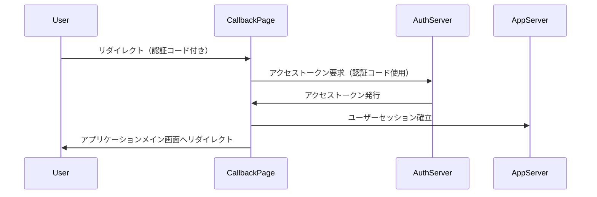

# OAuth 2.0 / OpenID Connect におけるコールバックページの概要

## 1. コールバックページとは

コールバックページ（またはリダイレクト URI とも呼ばれる）は、OAuth 2.0 / OpenID Connect 認証フローにおいて重要な役割を果たすページです。このページは、ユーザーが認証プロバイダ（例：Google、Facebook、カスタム OAuth サーバーなど）で認証を完了した後にリダイレクトされる、クライアントアプリケーション側のエンドポイントです。

## 2. コールバックページの役割

1. 認証コードの受け取り：認証プロバイダから発行された認証コードを受け取ります。
2. アクセストークンの取得：受け取った認証コードを使用してアクセストークンを取得します。
3. ユーザーセッションの確立：取得したアクセストークンを使用してユーザーセッションを確立します。
4. アプリケーションのメイン画面へのリダイレクト：認証プロセスが完了した後、ユーザーをアプリケーションの適切なページにリダイレクトします。

## 3. コールバックページの流れ



## 4. コールバックページの実装例（Vue.js 3）

```vue
<template>
  <div>認証中...</div>
</template>

<script>
import { onMounted } from "vue";
import { useRouter } from "vue-router";
import axios from "axios";

export default {
  setup() {
    const router = useRouter();

    onMounted(async () => {
      // URLから認証コードを取得
      const urlParams = new URLSearchParams(window.location.search);
      const code = urlParams.get("code");

      if (code) {
        try {
          // バックエンドAPIを呼び出してアクセストークンを取得
          const response = await axios.post("/api/auth/callback", { code });

          // アクセストークンをローカルストレージに保存
          localStorage.setItem("access_token", response.data.access_token);

          // ユーザーをダッシュボードにリダイレクト
          router.push("/dashboard");
        } catch (error) {
          console.error("認証エラー:", error);
          router.push("/login");
        }
      } else {
        console.error("認証コードがありません");
        router.push("/login");
      }
    });

    return {};
  },
};
</script>
```

## 5. セキュリティ考慮事項

1. リダイレクト URI の検証：認証サーバーは、事前に登録されたリダイレクト URI とのみ通信を行うようにします。
2. 状態パラメータの使用：CSRF 攻撃を防ぐため、認証リクエスト時に一意の「state」パラメータを含め、コールバック時にその値を検証します。
3. HTTPS の使用：すべての通信で HTTPS を使用し、データの盗聴を防ぎます。
4. アクセストークンの安全な保管：セキュアなストレージ（HttpOnly クッキーなど）を使用してアクセストークンを保存します。

## 6. ベストプラクティス

1. エラーハンドリング：認証プロセス中に発生する可能性のあるエラーを適切に処理し、ユーザーに分かりやすいメッセージを表示します。
2. ローディング表示：認証処理中はローディング表示を行い、ユーザーに進行状況を知らせます。
3. セッション管理：アクセストークンの有効期限を管理し、必要に応じてリフレッシュトークンを使用してセッションを更新します。
4. ログ記録：セキュリティ監査のため、認証プロセスの重要なステップをログに記録します（個人情報は含めない）。

コールバックページは、OAuth 2.0 / OpenID Connect 認証フローの重要な部分です。適切に実装することで、セキュアで円滑な認証プロセスを実現し、ユーザーエクスペリエンスを向上させることができます。
