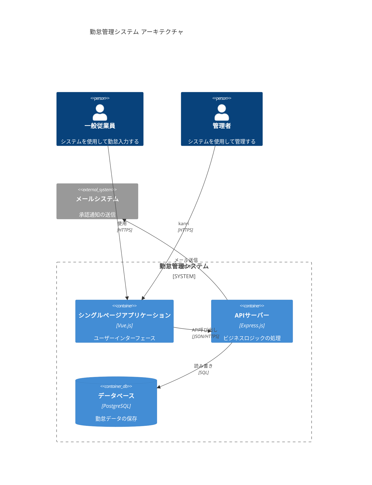

```mermaid
C4Container
title 勤怠管理システム アーキテクチャ

Person(employee, "一般従業員", "システムを使用して勤怠入力する")
Person(adminuser, "管理者", "システムを使用して管理する")

System_Boundary(attendance_system, "勤怠管理システム") {
    Container(spa, "シングルページアプリケーション", "Vue.js", "ユーザーインターフェース")
    Container(api, "APIサーバー", "Express.js", "ビジネスロジックの処理")
    ContainerDb(db, "データベース", "PostgreSQL", "勤怠データの保存")
}

System_Ext(email_system, "メールシステム", "承認通知の送信")

Rel(employee, spa, "使用", "HTTPS")
Rel(adminuser, spa, "kanri", "HTTPS")
Rel(spa, api, "API呼び出し", "JSON/HTTPS")
Rel(api, db, "読み書き", "SQL")
Rel(api, email_system, "メール送信", "SMTP")

UpdateLayoutConfig($c4ShapeInRow="3", $c4BoundaryInRow="1")
```
